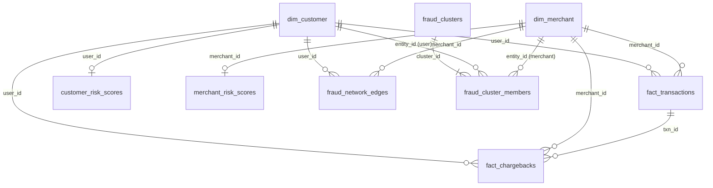

# UPI Guard (Datathon-LPU)

This is our LPU Datathon project. We took the messy Track-1 UPI dump (transactions, merchants, KYC, chargebacks), cleaned it in Python, loaded it into Supabase, and built a Next.js dashboard with an Ask AI page on top.

Repo: https://github.com/girishsaiteja/Datathon-LPU (public)

Dates in the data: **1 Jan 2026 → 3 Dec 2026**.

## If you are evaluating this repo

| What you asked for | Where it is |
| --- | --- |
| How to run the project | [How to run](#how-to-run) below |
| Data dictionary (every cleaned column) | [Data dictionary](#data-dictionary-cleaned-database) |
| Proof of data cleaning (raw vs cleaned counts + sample rows) | [Proof of data cleaning](#proof-of-data-cleaning) and `python Data/raw/src/cleaning/prove_row_counts.py` |
| Cleaning notebook with comments on each decision | [`notebooks/01_data_cleaning.ipynb`](notebooks/01_data_cleaning.ipynb) |
| Dashboard (pages, filters, charts) | [Dashboard](#dashboard) |
| ER relationships | [Database ER diagram](#database-er-diagram) |

We did **not** drop half the data. After standardising, we only removed exact duplicate rows. Retention is **98.4%** (65,894 raw → 64,834 cleaned).

## How to run

### 1) Dashboard (Next.js)

```bash
npm install
cp .env.example .env.local
# fill SUPABASE_DB_URL and GEMINI_API_KEY in .env.local
npm run dev
```

Open http://localhost:3000

`.env.example` lists `SUPABASE_DB_URL`, `NEXT_PUBLIC_SUPABASE_URL`, `NEXT_PUBLIC_SUPABASE_ANON_KEY`, `SUPABASE_SERVICE_ROLE_KEY`, `GEMINI_API_KEY`, `GEMINI_MODEL`.


See [Dashboard](#dashboard) for what each page shows.

Do not commit `.env` / `.env.local`.

### 2) Data cleaning (Python)

```bash
pip install -r requirements.txt
python Data/raw/src/run_pipeline.py
python Data/raw/src/cleaning/prove_row_counts.py
jupyter notebook notebooks/01_data_cleaning.ipynb
```

`run_pipeline.py` runs cleaning → unique customers/merchants → fact tables → risk scores → fraud clusters. Each cleaning script prints raw row count vs cleaned row count.

SQL for the warehouse is in `sql/` (`01` schema through `07` extra views). Loaders: `Data/raw/src/ingestion/load_to_supabase.py` and `load_advanced_analytics_to_supabase.py`.

## What we built

Python + pandas for cleaning. Postgres (Supabase) for the `datathon` schema. Next.js 15 for the UI. Recharts for graphs. Gemini for Ask AI on questions we did not hard-code.

---

## Dashboard

After `npm run dev`, the app reads the cleaned warehouse through Next.js API routes (`/api/dashboard`, `/api/merchants`, `/api/transactions`, `/api/fraud`, `/api/ask-ai`). Nothing on the charts is hardcoded mock data.

The date slider in the page header is **1 Jan 2026 – 3 Dec 2026**. Change it on one page and it stays the same on the others (cookie + localStorage) until you move it again.

| Route | Page | What it is for |
| --- | --- | --- |
| `/` | Home | Landing. Short pitch + link into the workspace. |
| `/dashboard` | Executive Dashboard | Portfolio KPIs, daily volume/value, success vs fail, chargebacks, hour-of-day failures, KYC mix, status / severity / reason donuts. Filters: merchant category, merchant status, KYC risk segment, user type. |
| `/merchants` | Merchant Analysis | Where GMV sits vs where disputes sit. Category leak (GMV share vs chargeback share), coxcomb / spike rose, top merchants by chargeback count and disputed amount. Filters: state, category, business type, status, risk level. |
| `/transactions` | Transaction Explorer | Searchable txn table (UTR, user, merchant) plus amount buckets, fail trend, dispute delay, KYC mix of disputers, high-value chargeback users. Filters: status, category, amount, user/merchant id. |
| `/fraud-network` | Fraud Network | Connected customer–merchant rings from `fraud_clusters`. Hub-and-spoke graph (blue users, green merchants). Click a node to open that cluster. Also lists repeat-dispute users and merchants. Filters: risk level, min transactions, category. |
| `/ask-ai` | Ask AI | Natural language over the live tables. Known questions hit SQL tools; new ones go to the planner. Out-of-range dates, jokes, and “delete the database” are refused. Charts are picked to match the answer. |
| `/about` | About | Stack and project notes. |

Shared chrome: navy sidebar, KPI cards, analyst-note callouts, Recharts panels. APIs live under `app/api/`. Query logic is in `lib/live-data.ts` against `lib/db.ts` (Supabase Postgres).

Example Ask AI questions that should work: highest-risk merchants, chargeback trend in Nov 2026, count vs rate of failed transactions. Dates after 3 Dec 2026 are out of range and get refused.

---

## Data pipeline

```
Data/raw/
  track1_upi_transactions.csv
  track1_merchants_master.csv
  track1_kyc_records.csv
  track1_chargebacks.json
        │
        ▼  Data/raw/src/cleaning/
  clean upi_trans and merchants_master.py
  clean kyc_records.py
  clean chargebacks.py
        │
        ▼  Data/processed/  (cleaned_* CSVs)
        │
        ▼  Data/raw/src/modeling/
  create_unique_customers.py
  create_unique_merchants.py
  build_fact_tables.py
        │
        ▼  Data/processed/  (dim_* + fact_*)
        │
        ▼  Data/raw/src/analytics/
  customer_risk_analysis.py
  merchant_risk_analysis.py
  fraud_network_analysis.py
        │
        ▼  Data/processed/  (risk scores + fraud_*)
        │
        ▼  Data/raw/src/ingestion/
  load_to_supabase.py
  load_advanced_analytics_to_supabase.py
        │
        ▼  Postgres schema `datathon`
```

| Stage | Raw rows | Cleaned / modeled rows | Script |
| --- | ---: | ---: | --- |
| UPI transactions | 20,400 | 20,000 (98.0% kept) | `clean upi_trans and merchants_master.py` |
| Merchants master | 6,210 | 6,102 (98.3% kept) | `clean upi_trans and merchants_master.py` |
| KYC records | 36,400 | 35,932 (98.7% kept) | `clean kyc_records.py` |
| Chargebacks | 2,884 | 2,800 (97.1% kept) | `clean chargebacks.py` |

Print the same table any time with:

```bash
python Data/raw/src/cleaning/prove_row_counts.py
```

We fix dates, ₹ amounts and aliases in place. The only rows we delete are exact duplicates after that. Missing MCC is filled from the other table when the merchant has a single MCC. Unmatched user/merchant ids stay on the fact tables (see `build_fact_tables.py`).


---

## Database ER diagram

Star schema in the `datathon` Postgres schema. Dimensions sit on the sides, payment and chargeback facts in the centre, then risk rollups and the fraud-network graph.


Vector source: [`docs/er-diagram.svg`](docs/er-diagram.svg).

Joins are **logical LEFT JOINs** (`sql/04_create_relationships.sql`), not hard `FOREIGN KEY` constraints, so unmatched customer / merchant / transaction ids stay in the facts for mule and orphan-id analysis.

| From | To | Cardinality | Join key |
| --- | --- | --- | --- |
| `dim_customer` | `fact_transactions` | 1 : N | `user_id` |
| `dim_merchant` | `fact_transactions` | 1 : N | `merchant_id` |
| `dim_customer` | `fact_chargebacks` | 1 : N | `user_id` |
| `dim_merchant` | `fact_chargebacks` | 1 : N | `merchant_id` |
| `fact_transactions` | `fact_chargebacks` | 1 : 0..N | `txn_id` |
| `dim_customer` | `customer_risk_scores` | 1 : 0..1 | `user_id` |
| `dim_merchant` | `merchant_risk_scores` | 1 : 0..1 | `merchant_id` |
| `dim_customer` | `fraud_network_edges` | 1 : N | `user_id` |
| `dim_merchant` | `fraud_network_edges` | 1 : N | `merchant_id` |
| `fraud_clusters` | `fraud_cluster_members` | 1 : N | `cluster_id` |
| `dim_customer` / `dim_merchant` | `fraud_cluster_members` | polymorphic | `entity_id` (`node_type` = `user` or `merchant`) |



---

## Data dictionary (cleaned database)

Every column in the `datathon` schema after cleaning and warehouse modeling.

### `dim_customer`

One row per unique UPI customer. Built from cleaned KYC (`cleaned_kyc_records.csv`) via `create_unique_customers.py`.

| Column | Type | Meaning |
| --- | --- | --- |
| `user_id` | VARCHAR(20) PK | Canonical customer id, always `USR` + digits with spaces/underscores removed. Bare 5-digit ids are prefixed `USR`. |
| `full_name` | VARCHAR(255) | Customer name. OCR-style `0`→`o` and `1`→`l` substitutions, whitespace collapsed, title case. |
| `pan` | VARCHAR(20) | Indian PAN. Uppercased, spaces and hyphens stripped. |
| `aadhaar` | VARCHAR(20) | Aadhaar number after digit-only cleanup. |
| `date_of_birth` | DATE | Date of birth as `YYYY-MM-DD`. Unix timestamps (including negative) and mixed date strings are converted; only years 1940–2010 are kept. |
| `city` | VARCHAR(100) | Standardized city (`Bombay`→`Mumbai`, `Madras`→`Chennai`, `Hyd`→`Hyderabad`, `Dilli`→`Delhi`, and so on). |
| `state` | VARCHAR(100) | Indian state aligned to the city map. |
| `monthly_income` | NUMERIC(15,2) | Declared monthly income in INR. `₹`, `Rs`, `INR`, commas, and `k` suffixes (`27.3k` → `27300`) are parsed to a number. |
| `occupation` | VARCHAR(100) | Occupation label, title-cased. |
| `signup_timestamp` | TIMESTAMP | When the customer signed up on the UPI app. Mixed / Unix timestamps normalized to datetime. |
| `kyc_status` | VARCHAR(30) | KYC outcome: `Approved`, `Rejected`, `Pending`, `In Progress`. Maps aliases such as `Done`, `Verified`, `V`, `KYC_Done` → `Approved`. |
| `risk_segment` | VARCHAR(30) | Onboarding risk band: `low`, `medium`, `high`. |

### `dim_merchant`

One logical merchant per `merchant_id`. Built from cleaned merchants (`cleaned_merchants_master.csv`) via `create_unique_merchants.py`. `merchant_key` is a surrogate key because raw files can repeat the same `merchant_id` with conflicting attributes.

| Column | Type | Meaning |
| --- | --- | --- |
| `merchant_key` | BIGSERIAL PK | Internal surrogate key. |
| `merchant_id` | VARCHAR(20) UNIQUE | Canonical merchant id, always `MCH` + 4 digits. Spaces removed; bare 4-digit ids prefixed `MCH`. |
| `merchant_name` | VARCHAR(255) | Merchant legal / trade name, title-cased. |
| `mcc` | INTEGER | Merchant Category Code (ISO 18245), e.g. `5411` grocery. |
| `merchant_category` | VARCHAR(100) | Standardized vertical used in the UI: `Apparel & Fashion`, `Books & Stationery`, `Department Store`, `Grocery`, `Hotel & Lodging`, `Medical`, `Miscellaneous`, `Pharmacy`, `Restaurants & Food`, `Retail`, `Telecom`, `Transportation`, `Travel`. Raw aliases such as `eating place`, `kirana`, `cloths`, `misc retail` are mapped here. |
| `business_type` | VARCHAR(100) | Legal form: Sole Proprietor, Partnership, Private Limited, Individual. |
| `city` | VARCHAR(100) | Standardized city (same city map as customers). |
| `state` | VARCHAR(100) | Indian state. |
| `onboarding_date` | DATE | Date the merchant was onboarded onto UPI. Mixed formats converted to `YYYY-MM-DD`. |
| `settlement_account` | VARCHAR(100) | Settlement bank account / VPA identifier used to pay the merchant. |
| `merchant_status` | VARCHAR(30) | Operating status: `Active`, `Inactive`, `On Hold`, `Suspended`. Maps `A`/`Live`/`Enabled` → `Active`. |
| `declared_avg_ticket_size` | NUMERIC(15,2) | Merchant-declared average ticket in INR. Currency symbols and commas stripped; empty values stay null. |

### `fact_transactions`

One UPI payment. Built from `cleaned_upi_transactions.csv` plus FK match flags in `build_fact_tables.py`.

| Column | Type | Meaning |
| --- | --- | --- |
| `txn_id` | VARCHAR(30) PK | Transaction id, `TXN` + 8 digits. |
| `user_id` | VARCHAR(20) | Payer customer id (`USR…`). |
| `merchant_id` | VARCHAR(20) | Payee merchant id (`MCH…`). |
| `timestamp` | TIMESTAMP | When the payment was attempted. Unix seconds (`1769823227`) and day-first strings (`05-01-26 9:33`) are converted to `YYYY-MM-DD HH:MM:SS`. |
| `amount` | NUMERIC(15,2) | Transaction amount in INR. `₹`, `Rs.`, `INR`, and thousands commas removed; always non-negative. |
| `utr` | VARCHAR(30) | Unique Transaction Reference from NPCI. Spaces stripped, uppercased (`UTR 9582999977` → `UTR9582999977`). |
| `mcc` | INTEGER | MCC copied from the transaction (may differ from the merchant master MCC). |
| `status` | VARCHAR(30) | Payment outcome: `Success`, `Failed`, `Pending`, `Processing`. Maps `COMPLETED`/`S`/`TXN_SUCCESS` → `Success`, `F`/`DECLINED` → `Failed`, `initiated` → `Processing`. |
| `customer_match_status` | VARCHAR(20) | `Matched` if `user_id` exists in `dim_customer`, else `Unmatched`. |
| `merchant_match_status` | VARCHAR(20) | `Matched` if `merchant_id` exists in `dim_merchant`, else `Unmatched`. |

### `fact_chargebacks`

One dispute / chargeback complaint. Built from `cleaned_chargebacks.csv` plus referential-integrity flags in `build_fact_tables.py`.

| Column | Type | Meaning |
| --- | --- | --- |
| `complaint_id` | VARCHAR(30) PK | Chargeback id, `CBK` + digits, uppercased. |
| `txn_id` | VARCHAR(30) | Linked transaction. Short ids such as `TXN12345` are padded to `TXN00012345`; hyphens removed. |
| `user_id` | VARCHAR(20) | Complainant customer id. |
| `merchant_id` | VARCHAR(20) | Disputed merchant id. Bare 4-digit ids prefixed `MCH`. |
| `transaction_timestamp` | TIMESTAMP | Original payment time (cleaned the same way as fact timestamps). |
| `reported_timestamp` | TIMESTAMP | When the customer raised the complaint. |
| `disputed_amount` | NUMERIC(15,2) | Amount under dispute in INR. Currency symbols and commas stripped. |
| `reason_code` | VARCHAR(100) | Canonical reason: `Merchant Not Delivered`, `Service Failed`, `Account Compromised`, `Unauthorized Transaction`, `Duplicate Debit`, `Incorrect Amount`, `Customer Dispute`, `Fraud`. Maps slang such as `ato`, `scam`, `dup_debit`, `no service`. |
| `complaint_text` | TEXT | Free-text customer complaint, whitespace-normalized, lowercased. |
| `resolution_status` | VARCHAR(50) | Case state: `Closed`, `Resolved`, `Rejected`, `Open`, `In Progress`, `Pending Bank`. Maps `wip` → `In Progress`. |
| `bank_response_timestamp` | TIMESTAMP | When the issuer / acquirer last responded. |
| `severity` | VARCHAR(30) | Priority: `Low`, `Medium`, `High`, `Critical`. Maps `L`/`P4` → `Low`, `H`/`P2` → `High`, `CRIT`/`P1` → `Critical`. |
| `channel` | VARCHAR(50) | Intake channel (App, IVR, Branch, Email, …), title-cased. |
| `customer_match_status` | VARCHAR(20) | `Matched` if complainant exists in `dim_customer`. |
| `merchant_match_status` | VARCHAR(20) | `Matched` if merchant exists in `dim_merchant`. |
| `transaction_match_status` | VARCHAR(20) | `Matched` if `txn_id` exists in `fact_transactions`. |
| `transaction_user_id` | VARCHAR(20) | `user_id` on the linked transaction (null if unmatched). |
| `transaction_merchant_id` | VARCHAR(20) | `merchant_id` on the linked transaction (null if unmatched). |
| `user_consistency_status` | VARCHAR(30) | `Match` if complaint `user_id` equals the transaction payer; `Mismatch` otherwise. Flags stolen-UTR / mis-linked complaints. |
| `merchant_consistency_status` | VARCHAR(30) | `Match` if complaint `merchant_id` equals the transaction payee; `Mismatch` otherwise. |

### `customer_risk_scores`

Per-customer risk rollup from `customer_risk_analysis.py`.

| Column | Type | Meaning |
| --- | --- | --- |
| `user_id` | VARCHAR(20) PK | Customer id. |
| `full_name` | VARCHAR(255) | Name from `dim_customer`. |
| `kyc_status` | VARCHAR(30) | Latest KYC status. |
| `risk_segment` | VARCHAR(30) | Onboarding segment (`low` / `medium` / `high`). |
| `monthly_income` | NUMERIC(15,2) | Declared monthly income. |
| `occupation` | VARCHAR(100) | Occupation. |
| `city` | VARCHAR(100) | City. |
| `state` | VARCHAR(100) | State. |
| `transaction_count` | INTEGER | Number of payments in the window. |
| `transaction_amount` | NUMERIC(18,2) | Sum of payment amounts. |
| `average_transaction_value` | NUMERIC(18,2) | Mean payment amount. |
| `failed_transaction_count` | INTEGER | Payments with status `Failed`. |
| `pending_transaction_count` | INTEGER | Payments with status `Pending`. |
| `dispute_count` | INTEGER | Chargebacks filed by this customer. |
| `disputed_amount` | NUMERIC(18,2) | Sum of disputed amounts. |
| `high_severity_disputes` | INTEGER | Disputes with severity `High`. |
| `critical_disputes` | INTEGER | Disputes with severity `Critical`. |
| `failed_rate` | NUMERIC(10,2) | Failed transactions ÷ transaction count × 100. |
| `dispute_rate` | NUMERIC(10,2) | Disputes ÷ transaction count × 100. |
| `risk_score` | NUMERIC(10,2) | Composite 0–100 score from failed rate, dispute rate, severity mix, and flags. |
| `risk_level` | VARCHAR(20) | Bucket: `Low`, `Medium`, `High`, `Critical`. |
| `repeated_dispute_flag` | BOOLEAN | True if the customer has multiple chargebacks. |
| `high_value_dispute_flag` | BOOLEAN | True if disputed amount is unusually large vs income / spend. |

### `merchant_risk_scores`

Per-merchant risk rollup from `merchant_risk_analysis.py`.

| Column | Type | Meaning |
| --- | --- | --- |
| `merchant_id` | VARCHAR(20) PK | Merchant id. |
| `merchant_name` | VARCHAR(255) | Name from `dim_merchant`. |
| `merchant_category` | VARCHAR(100) | Standardized category. |
| `business_type` | VARCHAR(100) | Legal form. |
| `city` | VARCHAR(100) | City. |
| `state` | VARCHAR(100) | State. |
| `merchant_status` | VARCHAR(30) | Operating status. |
| `declared_avg_ticket_size` | NUMERIC(18,2) | Declared average ticket. |
| `transaction_count` | INTEGER | Payments received. |
| `transaction_amount` | NUMERIC(18,2) | Gross payment volume. |
| `average_transaction_value` | NUMERIC(18,2) | Mean payment amount. |
| `successful_transactions` | INTEGER | Status `Success`. |
| `failed_transactions` | INTEGER | Status `Failed`. |
| `pending_transactions` | INTEGER | Status `Pending`. |
| `chargeback_count` | INTEGER | Chargebacks against this merchant. |
| `disputed_amount` | NUMERIC(18,2) | Sum of disputed amounts. |
| `high_severity_chargebacks` | INTEGER | Severity `High`. |
| `critical_chargebacks` | INTEGER | Severity `Critical`. |
| `failed_rate` | NUMERIC(10,2) | Failed ÷ transaction count × 100. |
| `chargeback_rate` | NUMERIC(10,2) | Chargebacks ÷ transaction count × 100. |
| `disputed_amount_rate` | NUMERIC(10,2) | Disputed amount ÷ transaction amount × 100. |
| `risk_score` | NUMERIC(10,2) | Composite 0–100 merchant risk score. |
| `risk_level` | VARCHAR(20) | `Low`, `Medium`, `High`, `Critical`. |
| `repeated_chargeback_flag` | BOOLEAN | True if the merchant has many repeat chargebacks. |
| `high_failed_rate_flag` | BOOLEAN | True if failed rate exceeds the risk threshold. |
| `high_chargeback_rate_flag` | BOOLEAN | True if chargeback rate exceeds the risk threshold. |

### `fraud_network_edges`

One edge = one customer–merchant pair that transacted together. Built by `fraud_network_analysis.py`.

| Column | Type | Meaning |
| --- | --- | --- |
| `user_id` | VARCHAR(20) | Customer node. Part of composite PK with `merchant_id`. |
| `merchant_id` | VARCHAR(20) | Merchant node. |
| `transaction_count` | INTEGER | Payments on this edge. |
| `transaction_amount` | NUMERIC(18,2) | Volume on this edge. |
| `failed_count` | INTEGER | Failed payments on this edge. |
| `chargeback_count` | INTEGER | Chargebacks on this edge. |
| `disputed_amount` | NUMERIC(18,2) | Disputed rupees on this edge. |
| `failed_rate` | NUMERIC(10,2) | Failed ÷ transaction count × 100. |
| `chargeback_rate` | NUMERIC(10,2) | Chargebacks ÷ transaction count × 100. |
| `edge_risk_score` | NUMERIC(10,2) | Risk of this relationship (failed + chargeback mix). |
| `risk_level` | VARCHAR(20) | `Low`, `Medium`, `High`, `Critical`. |

### `fraud_clusters`

Connected components of the user–merchant graph (collusive rings).

| Column | Type | Meaning |
| --- | --- | --- |
| `cluster_id` | INTEGER PK | Cluster number (1-based). |
| `user_count` | INTEGER | Distinct customers in the ring. |
| `merchant_count` | INTEGER | Distinct merchants in the ring. |
| `network_edge_count` | INTEGER | Edges inside the cluster. |
| `transaction_count` | INTEGER | Payments among members. |
| `transaction_amount` | NUMERIC(18,2) | Volume among members. |
| `failed_transaction_count` | INTEGER | Failed payments in the cluster. |
| `failed_rate` | NUMERIC(10,2) | Cluster failed rate (%). |
| `chargeback_count` | INTEGER | Chargebacks in the cluster. |
| `disputed_amount` | NUMERIC(18,2) | Disputed rupees in the cluster. |
| `chargeback_rate` | NUMERIC(10,2) | Cluster chargeback rate (%). |
| `high_risk_edges` | INTEGER | Edges whose `risk_level` is High or Critical. |
| `risk_score` | NUMERIC(10,2) | Cluster-level 0–100 score. |
| `risk_level` | VARCHAR(20) | `Low`, `Medium`, `High`, `Critical`. |

### `fraud_cluster_members`

Membership list for the Fraud Network graph.

| Column | Type | Meaning |
| --- | --- | --- |
| `cluster_id` | INTEGER | Parent cluster. Part of composite PK. |
| `node_type` | VARCHAR(20) | `user` or `merchant`. |
| `entity_id` | VARCHAR(30) | `USR…` or `MCH…` id of that node. |

---

## Proof of data cleaning

Run this and you get the raw vs cleaned counts (this is the script we want an evaluator to execute):

```bash
python Data/raw/src/cleaning/prove_row_counts.py
```

The notebook [`notebooks/01_data_cleaning.ipynb`](notebooks/01_data_cleaning.ipynb) goes through the same proof with comments on why we imputed vs dropped.

The rows below are real records from `Data/raw/` vs the matching rows in `Data/processed/`.


### 1. UPI transactions — `clean upi_trans and merchants_master.py`

**Raw** (`Data/raw/track1_upi_transactions.csv`, 20,400 rows)

| txn_id | timestamp | user_id | merchant_id | amount | utr | status |
| --- | --- | --- | --- | --- | --- | --- |
| TXN00003140 | `05-01-26 9:33` | USR10001 | MCH7754 | `Rs. 1720.78` | `UTR 9582999977` | `F` |
| TXN00008217 | `13-03-26 14:46` | USR10007 | MCH2501 | `Rs. 14075.13` | `UTR7905031096` | `SUCCESS` |
| TXN00019634 | `11-02-26` | USR10007 | MCH8176 | `12,698.20` | `UTR1853863028` | `SUCCESS` |
| TXN00014073 | `21-01-26 9:02` | USR10011 | MCH6493 | `8691.46` | `UTR8405170927` | `COMPLETED` |
| TXN00005067 | `14-02-26 8:17` | USR10012 | MCH9499 | `11,874.48` | `UTR9377715040` | `S` |
| TXN00008060 | `1769823227` | USR10207 | MCH4636 | `13800.2` | `UTR5311539263` | `Success` |
| TXN00004294 | `1772365114` | USR10273 | MCH6512 | `22701.38` | `UTR0676349117` | `TXN_SUCCESS` |

**Cleaned** (`Data/processed/cleaned_upi_transactions.csv`, 20,000 rows)

| txn_id | timestamp | user_id | merchant_id | amount | utr | status |
| --- | --- | --- | --- | --- | --- | --- |
| TXN00003140 | 2026-01-05 09:33:00 | USR10001 | MCH7754 | 1720.78 | UTR9582999977 | Failed |
| TXN00008217 | 2026-03-13 14:46:00 | USR10007 | MCH2501 | 14075.13 | UTR7905031096 | Success |
| TXN00019634 | 2026-02-11 00:00:00 | USR10007 | MCH8176 | 12698.20 | UTR1853863028 | Success |
| TXN00014073 | 2026-01-21 09:02:00 | USR10011 | MCH6493 | 8691.46 | UTR8405170927 | Success |
| TXN00005067 | 2026-02-14 08:17:00 | USR10012 | MCH9499 | 11874.48 | UTR9377715040 | Success |
| TXN00008060 | 2026-01-31 01:33:47 | USR10207 | MCH4636 | 13800.20 | UTR5311539263 | Success |
| TXN00004294 | 2026-03-01 11:38:34 | USR10273 | MCH6512 | 22701.38 | UTR0676349117 | Success |

What the script did on these rows:

- Day-first and Unix timestamps → ISO datetime
- `Rs.` / commas stripped from amount
- Spaces removed from UTR
- `F` → Failed, `SUCCESS` / `COMPLETED` / `S` / `TXN_SUCCESS` → Success
- 400 duplicate / invalid rows dropped (20,400 → 20,000)

### 2. Merchants — same script

**Raw** (`Data/raw/track1_merchants_master.csv`, 6,210 rows)

| merchant_id | merchant_name | merchant_category | city | merchant_status | declared_avg_ticket_size |
| --- | --- | --- | --- | --- | --- |
| `MCH 2430` | Bora Group | `TELECOM` | Amritsar | `A` | 827.43 |
| `MCH 9997` | Kalita, Dass and Balay | `misc retail` | `ludhiana` | `Live` | 2233.91 |
| `MCH4859` | VASA-RAJU | `Restaurant` | `Hyd` | `A` | `Rs. 214` |
| `mch4323` | Ben, Wagle and Shan | `eating place` | `Madras` | `SUSPENDED` | (blank) |
| `MCH9459` | Bala and Sons | `Grocery` | `Madras` | `Enabled` | 558.21 |
| `mch9951` | Natt Group | `Pharmacies` | `Madras` | `Enabled` | 1765.37 |

**Cleaned** (`Data/processed/cleaned_merchants_master.csv`, 6,102 rows)

| merchant_id | merchant_name | merchant_category | city | merchant_status | declared_avg_ticket_size |
| --- | --- | --- | --- | --- | --- |
| MCH2430 | Bora Group | Telecom | Amritsar | Active | 827.43 |
| MCH9997 | Kalita, Dass And Balay | Miscellaneous | Ludhiana | Active | 2233.91 |
| MCH4859 | Vasa-Raju | Restaurants & Food | Hyderabad | Active | 214.00 |
| MCH4323 | Ben, Wagle And Shan | Restaurants & Food | Chennai | Suspended | (null) |
| MCH9459 | Bala And Sons | Grocery | Chennai | Active | 558.21 |
| MCH9951 | Natt Group | Pharmacy | Chennai | Active | 1765.37 |

What the script did on these rows:

- `MCH 2430` / `mch4323` / bare digits → `MCH2430` / `MCH4323`
- Category aliases (`TELECOM`, `misc retail`, `eating place`, `Pharmacies`) → canonical categories
- City aliases (`Hyd`, `Madras`, `ludhiana`) → Hyderabad / Chennai / Ludhiana
- Status aliases (`A`, `Live`, `Enabled`, `SUSPENDED`) → Active / Suspended
- Ticket size `Rs. 214` → `214.00`
- Names title-cased; 108 dirty / duplicate rows dropped (6,210 → 6,102)

### 3. KYC / customers — `clean kyc_records.py`

**Raw** (`Data/raw/track1_kyc_records.csv`, 36,400 rows)

| user_id | full_name | monthly_income | kyc_status | city | risk_segment |
| --- | --- | --- | --- | --- | --- |
| USR16112 | Dhriti Deshmukh | 35119 | `Done` | `Bombay` | `LOW` |
| USR17216 | Megha Jani | 80907 | `Verified` | Lucknow | `medium` |
| `USR 45454` | `PANINI LAL` | `₹11,214` | `Pending` | `kolkata` | `High` |
| USR46189 | Jack Parikh | `27.3k` | `VERIFIED` | Amritsar | `low` |

**Cleaned** (`Data/processed/cleaned_kyc_records.csv`, 35,932 rows)

| user_id | full_name | monthly_income | kyc_status | city | risk_segment |
| --- | --- | --- | --- | --- | --- |
| USR16112 | Dhriti Deshmukh | 35119 | Approved | Mumbai | low |
| USR17216 | Megha Jani | 80907 | Approved | Lucknow | medium |
| USR45454 | Panini Lal | 11214 | Pending | Kolkata | high |
| USR46189 | Jack Parikh | 27300 | Approved | Amritsar | low |

What the script did on these rows:

- `USR 45454` → `USR45454` (spaces stripped; 5-digit ids get `USR` prefix)
- Names title-cased; OCR `0`/`1` repaired
- `₹11,214` → `11214`, `27.3k` → `27300`
- `Done` / `Verified` / `VERIFIED` → `Approved`
- `Bombay` → `Mumbai`, city title-cased
- Risk segment lowercased (`LOW` → `low`)
- 468 invalid / duplicate rows dropped (36,400 → 35,932)

### 4. Chargebacks — `clean chargebacks.py`

**Raw** (`Data/raw/track1_chargebacks.json`, 2,884 records)

| complaint_id | txn_id | user_id | merchant_id | disputed_amount | reason_code | severity |
| --- | --- | --- | --- | --- | --- | --- |
| CBK0001941 | TXN00003720 | USR54113 | `3835` | 414.69 | `login compromised` | `H` |
| CBK0001799 | TXN00012539 | USR17980 | `mch3700` | `Rs. 7,039` | `customer issue` | `P4` |
| CBK0002465 | TXN00017802 | USR76148 | MCH4534 | 1303.05 | `no service` | `H` |
| CBK0002663 | TXN00009741 | USR40631 | MCH9584 | `Rs. 548` | `service failed` | `LOW` |

**Cleaned** (`Data/processed/cleaned_chargebacks.csv`, 2,800 rows)

| complaint_id | txn_id | user_id | merchant_id | disputed_amount | reason_code | severity |
| --- | --- | --- | --- | --- | --- | --- |
| CBK0001941 | TXN00003720 | USR54113 | MCH3835 | 414.69 | Account Compromised | High |
| CBK0001799 | TXN00012539 | USR17980 | MCH3700 | 7039.00 | Customer Dispute | Low |
| CBK0002465 | TXN00017802 | USR76148 | MCH4534 | 1303.05 | Merchant Not Delivered | High |
| CBK0002663 | TXN00009741 | USR40631 | MCH9584 | 548.00 | Service Failed | Low |

What the script did on these rows:

- Bare merchant `3835` / `mch3700` → `MCH3835` / `MCH3700`
- `Rs. 7,039` / `Rs. 548` → numeric INR
- Reason slang (`login compromised`, `ato`, `no service`, `customer issue`) → canonical reason codes
- Severity aliases (`H`, `P4`, `LOW`) → High / Low
- 84 duplicate / unmapped rows dropped (2,884 → 2,800)

### 5. After cleaning: warehouse facts

`build_fact_tables.py` adds referential flags. Example from `Data/processed/fact_transactions.csv`:

| txn_id | timestamp | user_id | merchant_id | amount | status | customer_match_status | merchant_match_status |
| --- | --- | --- | --- | --- | --- | --- | --- |
| TXN00011869 | 2026-01-15 00:11:00 | USR45826 | MCH7045 | 15722.34 | Success | Unmatched | Unmatched |
| TXN00010383 | 2026-01-17 20:09:00 | USR79397 | MCH5031 | 6362.90 | Failed | Matched | Unmatched |

`Unmatched` means the payer or payee id is not in the corresponding dimension — those rows are still kept for fraud analysis (orphan / mule activity).

---

## Re-running the pipeline

```bash
python Data/raw/src/run_pipeline.py
```

That one command runs cleaning, unique dims, facts, risk scores and the fraud graph. Or step by step:

```bash
python "Data/raw/src/cleaning/clean upi_trans and merchants_master.py"
python "Data/raw/src/cleaning/clean kyc_records.py"
python "Data/raw/src/cleaning/clean chargebacks.py"
python Data/raw/src/modeling/create_unique_customers.py
python Data/raw/src/modeling/create_unique_merchants.py
python Data/raw/src/modeling/build_fact_tables.py
python Data/raw/src/analytics/customer_risk_analysis.py
python Data/raw/src/analytics/merchant_risk_analysis.py
python Data/raw/src/analytics/fraud_network_analysis.py
python Data/raw/src/cleaning/prove_row_counts.py
```

Checks: `Data/raw/src/validation/` (`validate_upi_trans.py`, `validate_kyc_records.py`, `validate_fact_tables.py`, `data_quality_report.py`, FK checks).


## Ask AI

`/ask-ai` classifies the question (analytics vs invalid vs destructive vs out-of-range dates), retrieves RAG knowledge, then either runs a known SQL tool or asks Gemini to plan a read-only query. The agent only answers inside the 1 Jan 2026 – 3 Dec 2026 window and refuses jokes, schema dumps, and destructive requests.
