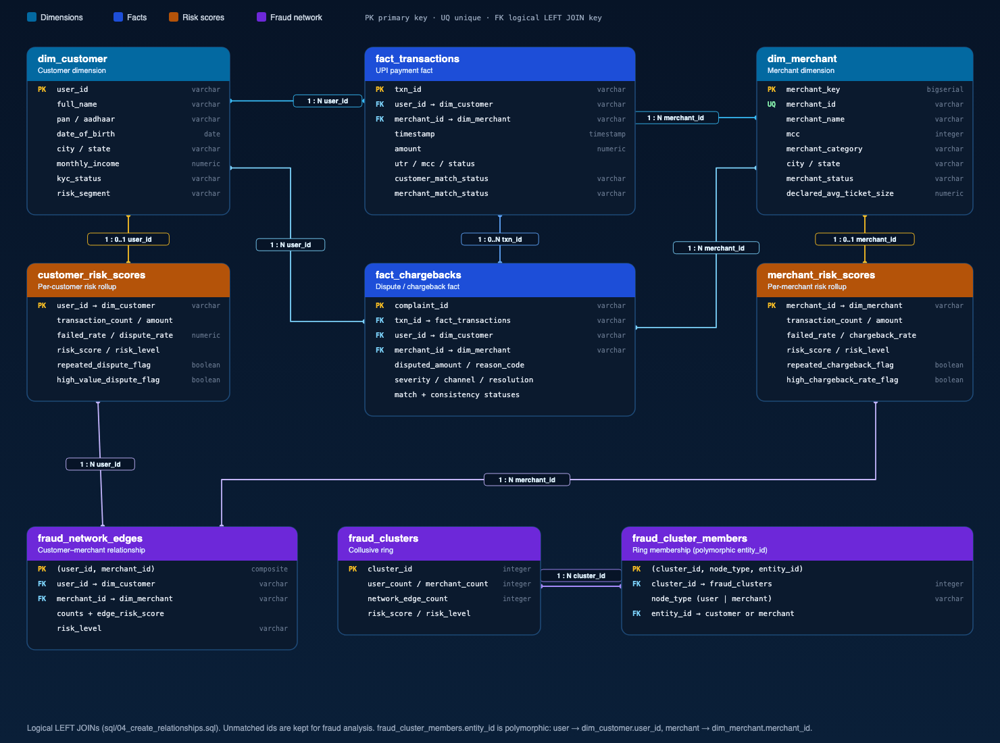
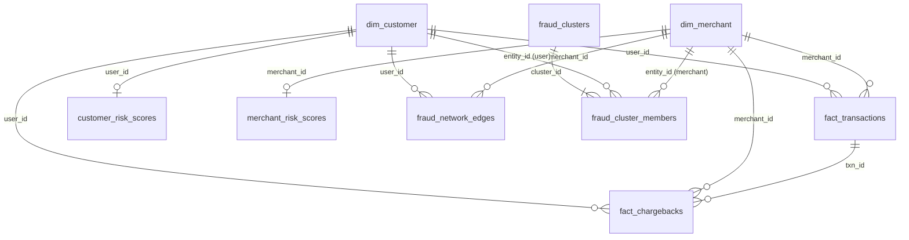

# UPI Guard

LPU Datathon project. We cleaned the Track-1 UPI files, loaded them into Supabase, and built a Next.js dashboard with Ask AI on top.

| | |
| --- | --- |
| **Repo** | [github.com/girishsaiteja/Datathon-LPU](https://github.com/girishsaiteja/Datathon-LPU) (public) |
| **Stack** | Python / pandas · Postgres (Supabase) · Next.js 15 · Recharts · Gemini |
| **Cleaning retention** | 98.4% kept (65,894 raw → 64,834 cleaned). We did not drop half the data. |

## Contents

1. [Quick start](#1-quick-start)
2. [Dashboard](#2-dashboard)
3. [Data pipeline](#3-data-pipeline)
4. [Proof of data cleaning](#4-proof-of-data-cleaning)
5. [Data dictionary](#5-data-dictionary)
6. [Database ER diagram](#6-database-er-diagram)
7. [Run the Python pipeline](#7-run-the-python-pipeline)
8. [Deploy on Vercel](#8-deploy-on-vercel)
9. [Ask AI](#9-ask-ai)

---

## 1. Quick start

### Dashboard

```bash
npm install
cp .env.example .env.local
# add SUPABASE_DB_URL and GEMINI_API_KEY
npm run dev
```

Open [http://localhost:3000](http://localhost:3000). Do not commit `.env` or `.env.local`.

| Variable | Needed for |
| --- | --- |
| `SUPABASE_DB_URL` | Live charts (Postgres) |
| `GEMINI_API_KEY` | Ask AI |
| `GEMINI_MODEL` | Optional. Default `gemini-3.8-flash` |
| `NEXT_PUBLIC_SUPABASE_URL` | Optional |
| `NEXT_PUBLIC_SUPABASE_ANON_KEY` | Optional |
| `SUPABASE_SERVICE_ROLE_KEY` | Optional (loaders) |

### Cleaning proof (one command)

```bash
pip install -r requirements.txt
python Data/raw/src/cleaning/prove_row_counts.py
```

Notebook with comments on each decision: [`notebooks/01_data_cleaning.ipynb`](notebooks/01_data_cleaning.ipynb)

---

## 2. Dashboard

Charts are live warehouse queries, not mock data. APIs: `/api/dashboard`, `/api/merchants`, `/api/transactions`, `/api/fraud`, `/api/ask-ai`.

The header date slider is **1 Jan 2026 – 3 Dec 2026**. Change it on one page and it stays on the others until you move it again.

| Route | Page | What you see |
| --- | --- | --- |
| `/` | Home | Landing |
| `/dashboard` | Executive Dashboard | KPIs, daily volume/value, success vs fail, chargebacks, hour-of-day failures, KYC / status / severity / reason charts. Filters: category, merchant status, risk segment, user type. |
| `/merchants` | Merchant Analysis | GMV vs dispute leak by category, top merchants by chargebacks and disputed amount. Filters: state, category, business type, status, risk. |
| `/transactions` | Transaction Explorer | Searchable table (UTR / user / merchant), amount buckets, fail trend, dispute delay. |
| `/fraud-network` | Fraud Network | Customer–merchant rings. Blue = users, green = merchants. Click a node to open that cluster. |
| `/ask-ai` | Ask AI | Questions over live tables. Invalid / destructive / out-of-range dates are refused. |
| `/about` | About | Project notes |

Code: pages in `app/`, charts in `components/`, SQL in `lib/live-data.ts`, DB in `lib/db.ts`.

---

## 3. Data pipeline

```
raw CSVs / JSON
        │
        ▼  cleaning scripts
cleaned_*.csv
        │
        ▼  modeling
dim_customer, dim_merchant, fact_transactions, fact_chargebacks
        │
        ▼  analytics
risk scores + fraud network
        │
        ▼  loaders
Postgres schema `datathon`
        │
        ▼  Next.js dashboard
```

| File | Raw | Cleaned | Kept | Script |
| --- | ---: | ---: | ---: | --- |
| UPI transactions | 20,400 | 20,000 | 98.0% | `clean upi_trans and merchants_master.py` |
| Merchants | 6,210 | 6,102 | 98.3% | same |
| KYC | 36,400 | 35,932 | 98.7% | `clean kyc_records.py` |
| Chargebacks | 2,884 | 2,800 | 97.1% | `clean chargebacks.py` |
| **Total** | **65,894** | **64,834** | **98.4%** | |

**Rule:** fix the value (dates, `₹` / `Rs.`, aliases). Only drop exact duplicate rows after that. Missing MCC is copied from the other table when that merchant has one MCC. Unmatched user / merchant ids stay on the fact tables.

Scripts live under `Data/raw/src/cleaning/`, `modeling/`, `analytics/`, `ingestion/`. SQL is in `sql/` (`01` … `07`).

---

## 4. Proof of data cleaning

```bash
python Data/raw/src/cleaning/prove_row_counts.py
```

Same walkthrough, with comments: [`notebooks/01_data_cleaning.ipynb`](notebooks/01_data_cleaning.ipynb)

Rows below are real records from `Data/raw/` vs `Data/processed/`.

### Transactions

Script: `clean upi_trans and merchants_master.py` · 20,400 → 20,000

**Raw** (`track1_upi_transactions.csv`)

| txn_id | timestamp | amount | utr | status |
| --- | --- | --- | --- | --- |
| TXN00003140 | `05-01-26 9:33` | `Rs. 1720.78` | `UTR 9582999977` | `F` |
| TXN00008217 | `13-03-26 14:46` | `Rs. 14075.13` | `UTR7905031096` | `SUCCESS` |
| TXN00019634 | `11-02-26` | `12,698.20` | `UTR1853863028` | `SUCCESS` |
| TXN00014073 | `21-01-26 9:02` | `8691.46` | `UTR8405170927` | `COMPLETED` |
| TXN00005067 | `14-02-26 8:17` | `11,874.48` | `UTR9377715040` | `S` |
| TXN00008060 | `1769823227` | `13800.2` | `UTR5311539263` | `Success` |
| TXN00004294 | `1772365114` | `22701.38` | `UTR0676349117` | `TXN_SUCCESS` |

**Cleaned** (`cleaned_upi_transactions.csv`)

| txn_id | timestamp | amount | utr | status |
| --- | --- | --- | --- | --- |
| TXN00003140 | 2026-01-05 09:33:00 | 1720.78 | UTR9582999977 | Failed |
| TXN00008217 | 2026-03-13 14:46:00 | 14075.13 | UTR7905031096 | Success |
| TXN00019634 | 2026-02-11 00:00:00 | 12698.20 | UTR1853863028 | Success |
| TXN00014073 | 2026-01-21 09:02:00 | 8691.46 | UTR8405170927 | Success |
| TXN00005067 | 2026-02-14 08:17:00 | 11874.48 | UTR9377715040 | Success |
| TXN00008060 | 2026-01-31 01:33:47 | 13800.20 | UTR5311539263 | Success |
| TXN00004294 | 2026-03-01 11:38:34 | 22701.38 | UTR0676349117 | Success |

What changed: unix / DD-MM-YY → ISO datetime · `Rs.` and commas stripped · UTR spaces removed · `F` / `S` / `COMPLETED` / `TXN_SUCCESS` mapped to Failed / Success.

### Merchants

Same script · 6,210 → 6,102

**Raw**

| merchant_id | merchant_category | city | merchant_status | declared_avg_ticket_size |
| --- | --- | --- | --- | --- |
| `MCH 2430` | `TELECOM` | Amritsar | `A` | 827.43 |
| `MCH 9997` | `misc retail` | `ludhiana` | `Live` | 2233.91 |
| `MCH4859` | `Restaurant` | `Hyd` | `A` | `Rs. 214` |
| `mch4323` | `eating place` | `Madras` | `SUSPENDED` | (blank) |
| `MCH9459` | `Grocery` | `Madras` | `Enabled` | 558.21 |
| `mch9951` | `Pharmacies` | `Madras` | `Enabled` | 1765.37 |

**Cleaned**

| merchant_id | merchant_category | city | merchant_status | declared_avg_ticket_size |
| --- | --- | --- | --- | --- |
| MCH2430 | Telecom | Amritsar | Active | 827.43 |
| MCH9997 | Miscellaneous | Ludhiana | Active | 2233.91 |
| MCH4859 | Restaurants & Food | Hyderabad | Active | 214.00 |
| MCH4323 | Restaurants & Food | Chennai | Suspended | (null) |
| MCH9459 | Grocery | Chennai | Active | 558.21 |
| MCH9951 | Pharmacy | Chennai | Active | 1765.37 |

What changed: ids padded to `MCH####` · city nicknames (`Hyd`, `Madras`) · status letters (`A`, `Live`) · ticket `Rs. 214` → 214.

### KYC

Script: `clean kyc_records.py` · 36,400 → 35,932

**Raw**

| user_id | full_name | monthly_income | kyc_status | city | risk_segment |
| --- | --- | --- | --- | --- | --- |
| USR16112 | Dhriti Deshmukh | 35119 | `Done` | `Bombay` | `LOW` |
| USR17216 | Megha Jani | 80907 | `Verified` | Lucknow | `medium` |
| `USR 45454` | `PANINI LAL` | `₹11,214` | `Pending` | `kolkata` | `High` |
| USR46189 | Jack Parikh | `27.3k` | `VERIFIED` | Amritsar | `low` |

**Cleaned**

| user_id | full_name | monthly_income | kyc_status | city | risk_segment |
| --- | --- | --- | --- | --- | --- |
| USR16112 | Dhriti Deshmukh | 35119 | Approved | Mumbai | low |
| USR17216 | Megha Jani | 80907 | Approved | Lucknow | medium |
| USR45454 | Panini Lal | 11214 | Pending | Kolkata | high |
| USR46189 | Jack Parikh | 27300 | Approved | Amritsar | low |

What changed: spaces stripped from ids · `₹` / `k` income · `Done` / `Verified` → Approved · `Bombay` → Mumbai.

### Chargebacks

Script: `clean chargebacks.py` · 2,884 → 2,800

**Raw**

| complaint_id | merchant_id | disputed_amount | reason_code | severity |
| --- | --- | --- | --- | --- |
| CBK0001941 | `3835` | 414.69 | `login compromised` | `H` |
| CBK0001799 | `mch3700` | `Rs. 7,039` | `customer issue` | `P4` |
| CBK0002465 | MCH4534 | 1303.05 | `no service` | `H` |
| CBK0002663 | MCH9584 | `Rs. 548` | `service failed` | `LOW` |

**Cleaned**

| complaint_id | merchant_id | disputed_amount | reason_code | severity |
| --- | --- | --- | --- | --- |
| CBK0001941 | MCH3835 | 414.69 | Account Compromised | High |
| CBK0001799 | MCH3700 | 7039.00 | Customer Dispute | Low |
| CBK0002465 | MCH4534 | 1303.05 | Merchant Not Delivered | High |
| CBK0002663 | MCH9584 | 548.00 | Service Failed | Low |

What changed: bare `3835` → `MCH3835` · `Rs.` stripped · reason / severity slang mapped.

### Fact flags (after modeling)

`build_fact_tables.py` adds match flags. Unmatched rows are **kept** (orphan / mule ids).

| txn_id | user_id | merchant_id | status | customer_match_status | merchant_match_status |
| --- | --- | --- | --- | --- | --- |
| TXN00011869 | USR45826 | MCH7045 | Success | Unmatched | Unmatched |
| TXN00010383 | USR79397 | MCH5031 | Failed | Matched | Unmatched |

---

## 5. Data dictionary

Every column in the cleaned `datathon` schema.

| Table | What it is |
| --- | --- |
| [`dim_customer`](#dim_customer) | One customer |
| [`dim_merchant`](#dim_merchant) | One merchant |
| [`fact_transactions`](#fact_transactions) | One UPI payment |
| [`fact_chargebacks`](#fact_chargebacks) | One dispute |
| [`customer_risk_scores`](#customer_risk_scores) | Per-customer risk |
| [`merchant_risk_scores`](#merchant_risk_scores) | Per-merchant risk |
| [`fraud_network_edges`](#fraud_network_edges) | User–merchant pair |
| [`fraud_clusters`](#fraud_clusters) | Collusive ring |
| [`fraud_cluster_members`](#fraud_cluster_members) | Who is in the ring |

### `dim_customer`

From cleaned KYC via `create_unique_customers.py`. Duplicate `user_id`s: keep the most complete row.

| Column | Type | Meaning |
| --- | --- | --- |
| `user_id` | VARCHAR(20) PK | `USR` + digits. Spaces removed. Bare 5-digit ids get `USR`. |
| `full_name` | VARCHAR(255) | Title case. OCR `0`→`o`, `1`→`l`. |
| `pan` | VARCHAR(20) | Uppercase, no spaces/hyphens. |
| `aadhaar` | VARCHAR(20) | Digits only. |
| `date_of_birth` | DATE | `YYYY-MM-DD`. Unix (incl. negative) and mixed strings. Years 1940–2010 only. |
| `city` | VARCHAR(100) | Mapped (`Bombay`→`Mumbai`, `Madras`→`Chennai`, `Hyd`→`Hyderabad`). |
| `state` | VARCHAR(100) | Indian state. |
| `monthly_income` | NUMERIC(15,2) | INR. Parses `₹`, `Rs`, `INR`, commas, `27.3k` → 27300. |
| `occupation` | VARCHAR(100) | Title-cased. |
| `signup_timestamp` | TIMESTAMP | Signup time, same date parsers. |
| `kyc_status` | VARCHAR(30) | `Approved`, `Rejected`, `Pending`, `In Progress`. |
| `risk_segment` | VARCHAR(30) | `low` / `medium` / `high`. |

### `dim_merchant`

From cleaned merchants via `create_unique_merchants.py`. `merchant_key` is a surrogate PK because the same `merchant_id` can appear more than once in raw.

| Column | Type | Meaning |
| --- | --- | --- |
| `merchant_key` | BIGSERIAL PK | Internal key. |
| `merchant_id` | VARCHAR(20) UNIQUE | `MCH` + 4 digits. |
| `merchant_name` | VARCHAR(255) | Title-cased. |
| `mcc` | INTEGER | ISO 18245 code (e.g. 5411 grocery). |
| `merchant_category` | VARCHAR(100) | UI category: Apparel & Fashion, Grocery, Hotel & Lodging, Medical, Pharmacy, Restaurants & Food, Retail, Telecom, Transportation, Travel, etc. |
| `business_type` | VARCHAR(100) | Sole Proprietor / Partnership / Private Limited / Individual. |
| `city` | VARCHAR(100) | Same city map as customers. |
| `state` | VARCHAR(100) | Indian state. |
| `onboarding_date` | DATE | `YYYY-MM-DD`. |
| `settlement_account` | VARCHAR(100) | Settlement account / VPA. |
| `merchant_status` | VARCHAR(30) | `Active`, `Inactive`, `On Hold`, `Suspended`. |
| `declared_avg_ticket_size` | NUMERIC(15,2) | Declared average ticket in INR. Empty stays null. |

### `fact_transactions`

From `cleaned_upi_transactions.csv` + match flags in `build_fact_tables.py`.

| Column | Type | Meaning |
| --- | --- | --- |
| `txn_id` | VARCHAR(30) PK | `TXN` + 8 digits. |
| `user_id` | VARCHAR(20) | Payer (`USR…`). |
| `merchant_id` | VARCHAR(20) | Payee (`MCH…`). |
| `timestamp` | TIMESTAMP | Payment time. Unix or day-first string → ISO. |
| `amount` | NUMERIC(15,2) | INR, non-negative. |
| `utr` | VARCHAR(30) | NPCI UTR. Spaces stripped, uppercased. |
| `mcc` | INTEGER | MCC on the txn (may differ from merchant master). |
| `status` | VARCHAR(30) | `Success`, `Failed`, `Pending`, `Processing`. |
| `customer_match_status` | VARCHAR(20) | `Matched` if `user_id` is in `dim_customer`. |
| `merchant_match_status` | VARCHAR(20) | `Matched` if `merchant_id` is in `dim_merchant`. |

### `fact_chargebacks`

From `cleaned_chargebacks.csv` + integrity flags.

| Column | Type | Meaning |
| --- | --- | --- |
| `complaint_id` | VARCHAR(30) PK | `CBK` + digits. |
| `txn_id` | VARCHAR(30) | Linked payment. Short ids padded (`TXN12345` → `TXN00012345`). |
| `user_id` | VARCHAR(20) | Complainant. |
| `merchant_id` | VARCHAR(20) | Disputed merchant. Bare 4 digits get `MCH`. |
| `transaction_timestamp` | TIMESTAMP | Original payment time. |
| `reported_timestamp` | TIMESTAMP | When the complaint was raised. |
| `disputed_amount` | NUMERIC(15,2) | Amount under dispute (INR). |
| `reason_code` | VARCHAR(100) | Canonical reason (Merchant Not Delivered, Account Compromised, Fraud, …). |
| `complaint_text` | TEXT | Customer text, normalised. |
| `resolution_status` | VARCHAR(50) | Closed / Resolved / Rejected / Open / In Progress / Pending Bank. |
| `bank_response_timestamp` | TIMESTAMP | Last issuer/acquirer response. |
| `severity` | VARCHAR(30) | Low / Medium / High / Critical. |
| `channel` | VARCHAR(50) | App, IVR, Branch, Email, … |
| `customer_match_status` | VARCHAR(20) | Complainant in `dim_customer`? |
| `merchant_match_status` | VARCHAR(20) | Merchant in `dim_merchant`? |
| `transaction_match_status` | VARCHAR(20) | `txn_id` in `fact_transactions`? |
| `transaction_user_id` | VARCHAR(20) | Payer on the linked txn (null if unmatched). |
| `transaction_merchant_id` | VARCHAR(20) | Payee on the linked txn. |
| `user_consistency_status` | VARCHAR(30) | Complaint user vs txn payer (`Match` / `Mismatch`). |
| `merchant_consistency_status` | VARCHAR(30) | Complaint merchant vs txn payee. |

### `customer_risk_scores`

From `customer_risk_analysis.py`.

| Column | Type | Meaning |
| --- | --- | --- |
| `user_id` | VARCHAR(20) PK | Customer. |
| `full_name` | VARCHAR(255) | From `dim_customer`. |
| `kyc_status` | VARCHAR(30) | Latest KYC. |
| `risk_segment` | VARCHAR(30) | Onboarding band. |
| `monthly_income` | NUMERIC(15,2) | Declared income. |
| `occupation` | VARCHAR(100) | Occupation. |
| `city` / `state` | VARCHAR(100) | Location. |
| `transaction_count` | INTEGER | Payments in the window. |
| `transaction_amount` | NUMERIC(18,2) | Sum of amounts. |
| `average_transaction_value` | NUMERIC(18,2) | Mean amount. |
| `failed_transaction_count` | INTEGER | Status `Failed`. |
| `pending_transaction_count` | INTEGER | Status `Pending`. |
| `dispute_count` | INTEGER | Chargebacks filed. |
| `disputed_amount` | NUMERIC(18,2) | Sum of disputes. |
| `high_severity_disputes` | INTEGER | Severity High. |
| `critical_disputes` | INTEGER | Severity Critical. |
| `failed_rate` | NUMERIC(10,2) | Failed ÷ txns × 100. |
| `dispute_rate` | NUMERIC(10,2) | Disputes ÷ txns × 100. |
| `risk_score` | NUMERIC(10,2) | 0–100. |
| `risk_level` | VARCHAR(20) | Low / Medium / High / Critical. |
| `repeated_dispute_flag` | BOOLEAN | More than one chargeback. |
| `high_value_dispute_flag` | BOOLEAN | Large disputed amount vs income/spend. |

### `merchant_risk_scores`

From `merchant_risk_analysis.py`.

| Column | Type | Meaning |
| --- | --- | --- |
| `merchant_id` | VARCHAR(20) PK | Merchant. |
| `merchant_name` | VARCHAR(255) | From `dim_merchant`. |
| `merchant_category` | VARCHAR(100) | Category. |
| `business_type` | VARCHAR(100) | Legal form. |
| `city` / `state` | VARCHAR(100) | Location. |
| `merchant_status` | VARCHAR(30) | Operating status. |
| `declared_avg_ticket_size` | NUMERIC(18,2) | Declared ticket. |
| `transaction_count` | INTEGER | Payments received. |
| `transaction_amount` | NUMERIC(18,2) | GMV. |
| `average_transaction_value` | NUMERIC(18,2) | Mean payment. |
| `successful_transactions` | INTEGER | Status Success. |
| `failed_transactions` | INTEGER | Status Failed. |
| `pending_transactions` | INTEGER | Status Pending. |
| `chargeback_count` | INTEGER | Chargebacks. |
| `disputed_amount` | NUMERIC(18,2) | Disputed rupees. |
| `high_severity_chargebacks` | INTEGER | Severity High. |
| `critical_chargebacks` | INTEGER | Severity Critical. |
| `failed_rate` | NUMERIC(10,2) | Failed ÷ txns × 100. |
| `chargeback_rate` | NUMERIC(10,2) | Chargebacks ÷ txns × 100. |
| `disputed_amount_rate` | NUMERIC(10,2) | Disputed ÷ GMV × 100. |
| `risk_score` | NUMERIC(10,2) | 0–100. |
| `risk_level` | VARCHAR(20) | Low / Medium / High / Critical. |
| `repeated_chargeback_flag` | BOOLEAN | Repeat chargebacks. |
| `high_failed_rate_flag` | BOOLEAN | Failed rate above threshold. |
| `high_chargeback_rate_flag` | BOOLEAN | Chargeback rate above threshold. |

### `fraud_network_edges`

One row = one customer–merchant pair that transacted. From `fraud_network_analysis.py`.

| Column | Type | Meaning |
| --- | --- | --- |
| `user_id` | VARCHAR(20) | Customer node. PK with `merchant_id`. |
| `merchant_id` | VARCHAR(20) | Merchant node. |
| `transaction_count` | INTEGER | Payments on this edge. |
| `transaction_amount` | NUMERIC(18,2) | Volume. |
| `failed_count` | INTEGER | Failed payments. |
| `chargeback_count` | INTEGER | Chargebacks. |
| `disputed_amount` | NUMERIC(18,2) | Disputed rupees. |
| `failed_rate` | NUMERIC(10,2) | Failed ÷ txns × 100. |
| `chargeback_rate` | NUMERIC(10,2) | Chargebacks ÷ txns × 100. |
| `edge_risk_score` | NUMERIC(10,2) | Relationship risk. |
| `risk_level` | VARCHAR(20) | Low / Medium / High / Critical. |

### `fraud_clusters`

Connected components of that graph.

| Column | Type | Meaning |
| --- | --- | --- |
| `cluster_id` | INTEGER PK | Ring number. |
| `user_count` | INTEGER | Distinct customers. |
| `merchant_count` | INTEGER | Distinct merchants. |
| `network_edge_count` | INTEGER | Edges in the ring. |
| `transaction_count` | INTEGER | Payments among members. |
| `transaction_amount` | NUMERIC(18,2) | Volume. |
| `failed_transaction_count` | INTEGER | Failed payments. |
| `failed_rate` | NUMERIC(10,2) | Failed rate %. |
| `chargeback_count` | INTEGER | Chargebacks. |
| `disputed_amount` | NUMERIC(18,2) | Disputed rupees. |
| `chargeback_rate` | NUMERIC(10,2) | Chargeback rate %. |
| `high_risk_edges` | INTEGER | High/Critical edges. |
| `risk_score` | NUMERIC(10,2) | 0–100. |
| `risk_level` | VARCHAR(20) | Low / Medium / High / Critical. |

### `fraud_cluster_members`

| Column | Type | Meaning |
| --- | --- | --- |
| `cluster_id` | INTEGER | Parent cluster. Part of PK. |
| `node_type` | VARCHAR(20) | `user` or `merchant`. |
| `entity_id` | VARCHAR(30) | `USR…` or `MCH…`. |

---

## 6. Database ER diagram

Star schema: dimensions on the sides, facts in the middle, then risk scores and the fraud graph.



Vector: [`docs/er-diagram.svg`](docs/er-diagram.svg)

Joins are **LEFT JOINs** (`sql/04_create_relationships.sql`), not hard foreign keys. Unmatched ids stay in the facts.

| From | To | Cardinality | Key |
| --- | --- | --- | --- |
| `dim_customer` | `fact_transactions` | 1 : N | `user_id` |
| `dim_merchant` | `fact_transactions` | 1 : N | `merchant_id` |
| `dim_customer` | `fact_chargebacks` | 1 : N | `user_id` |
| `dim_merchant` | `fact_chargebacks` | 1 : N | `merchant_id` |
| `fact_transactions` | `fact_chargebacks` | 1 : 0..N | `txn_id` |
| `dim_customer` | `customer_risk_scores` | 1 : 0..1 | `user_id` |
| `dim_merchant` | `merchant_risk_scores` | 1 : 0..1 | `merchant_id` |
| `dim_customer` | `fraud_network_edges` | 1 : N | `user_id` |
| `dim_merchant` | `fraud_network_edges` | 1 : N | `merchant_id` |
| `fraud_clusters` | `fraud_cluster_members` | 1 : N | `cluster_id` |
| customer / merchant | `fraud_cluster_members` | polymorphic | `entity_id` |



---

## 7. Run the Python pipeline

```bash
pip install -r requirements.txt
python Data/raw/src/run_pipeline.py
python Data/raw/src/cleaning/prove_row_counts.py
```

`run_pipeline.py` runs: cleaning → unique dims → facts → risk scores → fraud clusters.

Step by step:

```bash
python "Data/raw/src/cleaning/clean upi_trans and merchants_master.py"
python "Data/raw/src/cleaning/clean kyc_records.py"
python "Data/raw/src/cleaning/clean chargebacks.py"
python Data/raw/src/modeling/create_unique_customers.py
python Data/raw/src/modeling/create_unique_merchants.py
python Data/raw/src/modeling/build_fact_tables.py
python Data/raw/src/analytics/customer_risk_analysis.py
python Data/raw/src/analytics/merchant_risk_analysis.py
python Data/raw/src/analytics/fraud_network_analysis.py
```

Load to Supabase: `Data/raw/src/ingestion/load_to_supabase.py` and `load_advanced_analytics_to_supabase.py`.

Checks: `Data/raw/src/validation/` (`validate_upi_trans.py`, `validate_kyc_records.py`, `validate_fact_tables.py`, `data_quality_report.py`).

---

## 8. Deploy on Vercel

The Next.js app deploys. Python cleaning does not run on Vercel.

1. Import the GitHub repo in [vercel.com](https://vercel.com), or run `npx vercel` from this folder.
2. Framework: Next.js (auto).
3. Set env vars for Production and Preview:

| Name | Required |
| --- | --- |
| `SUPABASE_DB_URL` | Yes. Use the Supabase **pooler** URI (port **6543**, transaction mode), not direct `5432`. Vercel is IPv4-only. |
| `GEMINI_API_KEY` | Yes for Ask AI |
| `GEMINI_MODEL` | Optional |

4. Deploy. You get a `*.vercel.app` URL.

Dashboard pages work on the Hobby plan. Ask AI may hit the ~10s Hobby timeout; use Pro or run Ask AI locally if that happens.

---

## 9. Ask AI

`/ask-ai` classifies the question (analytics / invalid / destructive / out-of-range date), then runs a known SQL tool or asks Gemini to plan a **read-only** query.

Works inside **1 Jan 2026 – 3 Dec 2026** only.

| Try | Expected |
| --- | --- |
| Highest-risk merchants | Ranked list + chart |
| Chargeback trend in Nov 2026 | Daily trend |
| Count vs rate of failed transactions | Both metrics |
| Why did fraud increase on 20 Dec 2026 | Refused (data ends 3 Dec) |
| Delete the database / jokes | Refused |
